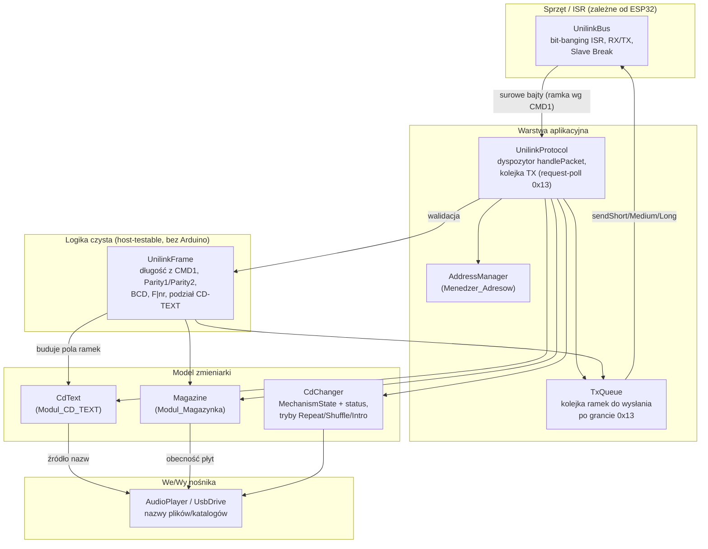
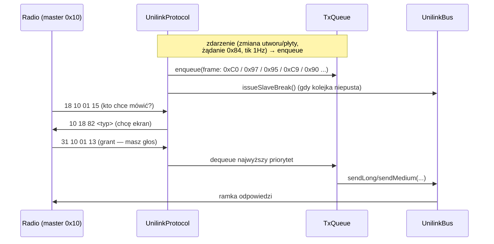

# Design Document

## Overview

Celem tego dokumentu jest zaprojektowanie zmian uzgadniających (alignment)
emulator zmieniarki CD Sony UniLink (ESP32 / Arduino C++) z protokołem opisanym
w `UNILINK_PROTOKOL_KOMPENDIUM.md`. Źródłem prawdy jest protokół magistrali
UniLink (Kompendium), a nie empiryczne kwirki pojedynczego radia testowego.

Projekt wychodzi od **realnej, istniejącej struktury kodu** w `ESP32/Emulator/`:

- `UnilinkBus` (namespace) — warstwa fizyczna: bit-banging w przerwaniu zegara,
  składanie bajtów RX, nadawanie ramek (`sendShort`/`sendMedium`/`sendLong`/
  `sendRaw`), `issueSlaveBreak`, `readPacketIfIdle`. Operuje wyłącznie na
  surowych bajtach.
- `UnilinkProtocol` (namespace) — warstwa aplikacyjna: dyspozytor `handlePacket`,
  discovery/przydział adresu, harmonogram Slave Break, kwirki CDX-M670.
- `CdChanger` (namespace) — model zmieniarki: maszyna stanów (`enum State`),
  licznik czasu, NVS, nawigacja, koordynacja z `AudioPlayer`.
- `AudioPlayer` / `UsbDrive` — odtwarzanie plików z pendrive'a (foldery
  `CD01..CD10`).
- `Diagnostics` — czarna skrzynka (ring buffer ramek RX/TX).

Kluczowe obserwacje z analizy kodu, które kształtują projekt:

1. **Granica ramki jest dziś wyznaczana tylko ciszą.** `readPacketIfIdle`
   zrzuca cały bufor RX po `READ_SILENCE_US`, nie używając CMD1 do określenia
   długości (niezgodność z Kompendium §3). → Wymaganie 3.
2. **Walidacja sprawdza tylko `buf[4]` (Parity1).** `handlePacket` nie liczy
   Parity2 ani bajtu końcowego dla ramek middle/long (niezgodność z §4). →
   Wymaganie 2.
3. **Adres startowy to `0x31` na sztywno** (`ADDR_DEFAULT = 0x31`), a adopcja
   obejmuje tylko `0x31..0x3A`. Kompendium §5/§6 wymaga startu z `0x30` (grupa
   CD, brak ID) i adopcji dowolnego ID z grupy `0x3X`. → Wymaganie 4.
4. **`enum State` miesza stan mechanizmu z bajtem statusu** wysyłanym w PONG:
   `STATE_INIT = 0xC0` (w §7.1 `0xC0` = Ejecting), `STATE_SEEKING = 0x20`
   (w §7.1 `0x20` = Changed CD), a kod `0x21` (Seeking) nigdy nie jest wysyłany.
   → Wymaganie 5.
5. **Brak modułów CD-TEXT, magazynka, trybów Repeat/Shuffle/Intro, wyboru płyty
   `0xB0`, ramki `0x90`, zakończenia przewijania broadcastem `0x08`.** Dyspozytor
   reaguje tylko na podzbiór komend. → Wymagania 6–11.
6. **Brak kolejki TX wyższego poziomu.** Na `0x01 0x13` wysyłana jest tylko jedna
   ramka `0xC0`; Kompendium §7.2 opisuje kolejkowanie bloku odpowiedzi (status,
   info, nazwy, czas). → architektura kolejki TX.

Strategia nadrzędna projektu: **wydzielić czystą, beznosprzętową logikę
protokołu** (długość ramki, sumy kontrolne, kodowanie BCD/numeru płyty, podział
CD-TEXT na pola) do osobnego modułu `UnilinkFrame`, który kompiluje się natywnie
na hoście i nadaje się do testów property-based, niezależnie od ESP32.

## Architecture

### Warstwy i przepływ danych



### Zasada podziału na warstwę czystą i sprzętową

Cała logika, którą da się opisać jako „dla dowolnego wejścia X zachodzi
własność P(X)", trafia do modułu **`UnilinkFrame`** (czyste funkcje, brak
zależności od `Arduino.h`, brak ISR, brak globalnego stanu sprzętu). Dzięki temu
te same pliki kompilują się:

- na ESP32 w ramach szkicu Arduino,
- natywnie na hoście (np. `g++`/`clang`) na potrzeby testów property-based.

`UnilinkBus` pozostaje cienką warstwą sprzętową: timing, ISR, Slave Break.
Logikę „ile bajtów ma ta ramka" i „czy sumy się zgadzają" przenosimy z ISR/
dyspozytora do `UnilinkFrame`, a `UnilinkBus`/`UnilinkProtocol` tylko ją wołają.

### Cykl pracy i kolejka TX (request-poll 0x13)

Zgodnie z Kompendium §7.2 i §12.4 zmieniarka **kolejkuje** odpowiedzi i wysyła je
dopiero po otrzymaniu grantu `0x01 0x13`. Wprowadzamy komponent **`TxQueue`**
wewnątrz `UnilinkProtocol`:



Priorytety w kolejce (od najwyższego): status `0xC0`/PONG → disc ID `0xC5/0xD5`
→ info magazynka `0x95`/`0x97` → nazwy CD-TEXT (`0xC9/0xCD/0xD9/0xDD/0xD2`) →
ramka czasu `0x90`. Pojedynczy grant `0x13` zdejmuje jedną ramkę; kolejne granty
opróżniają kolejkę. PONG na `0x01 0x12` (time-poll) jest wysyłany natychmiast
(poza kolejką), bo to bezpośrednia odpowiedź na poll, nie blok danych.

### Zachowanie wiedzy o timingu (Stan_Wysokiego_Ryzyka)

Wszystkie stałe czasowe w `Config.h` (`BREAK_SILENCE_US`, `BREAK_HOLD_US`,
`DISPLAY_KEEPALIVE_MS`, `READ_SILENCE_US`, `INIT_DURATION_MS`, …) oraz komentarze
ostrzegawcze o strojeniu pozostają nietknięte co do wartości. Zmiany w warstwie
ramki (parser CMD1, walidacja sum) **nie modyfikują** wartości czasowych —
operują na już odebranych bajtach. Każda zmiana dotykająca timingu lub struktury
bitowej ramki musi być oznaczona komentarzem `// [HIGH-RISK]` z opisem wpływu i
sposobem przywrócenia (Wymaganie 1.5, 12.2).

## Components and Interfaces

### 1. UnilinkFrame (nowy moduł — logika czysta, host-testable)

Plik `UnilinkFrame.h` / `UnilinkFrame.cpp`. Bez `#include <Arduino.h>` — tylko
`<stdint.h>`/`<stddef.h>`. Zawiera całą logikę „matematyki ramek".

```cpp
namespace UnilinkFrame {

enum class FrameSize : uint8_t { Short = 6, Middle = 11, Long = 16 };

// R3: długość ramki wyznaczona przez CMD1.
//  CMD1 < 0x80           -> 6  (short)
//  0x80 <= CMD1 < 0xC0   -> 11 (middle)
//  CMD1 >= 0xC0          -> 16 (long)
FrameSize sizeFromCmd1(uint8_t cmd1);
int       lengthFromCmd1(uint8_t cmd1);   // 6 / 11 / 16

// R2/R4: sumy kontrolne.
uint8_t parity1(uint8_t rad, uint8_t tad, uint8_t cmd1, uint8_t cmd2);
uint8_t parity2(uint8_t parity1, const uint8_t* data, int dataLen);

// R2: walidacja kompletnej ramki (parzystości + bajt końcowy = 0).
// Zwraca kod wyniku (OK / BadParity1 / BadParity2 / BadEnd / BadLength).
enum class ValidateResult : uint8_t { Ok, BadLength, BadParity1, BadParity2, BadEnd };
ValidateResult validate(const uint8_t* frame, int len);

// R7.4 / R11.x: kodowanie numeru płyty jako F|nr (F1=1 ... F9=9, F0=puste).
uint8_t encodeDiscNibble(uint8_t discNumber);   // 1 -> 0xF1, 4 -> 0xF4
uint8_t discNibbleToNumber(uint8_t encoded);     // 0xF1 -> 1 (odwrotność)

// R11: kodowanie BCD czasu/utworu z F-paddingiem dla wartości < 10.
uint8_t encodeBcd(uint8_t value);                // 59 -> 0x59, 7 -> 0x07
uint8_t decodeBcd(uint8_t bcd);                  // 0x59 -> 59
uint8_t encodeBcdFpad(uint8_t value);            // 7 -> 0xF7, 12 -> 0x12

} // namespace UnilinkFrame
```

**Decyzja:** `UnilinkBus::sendShort/sendMedium/sendLong` po refaktorze liczą
parzystości przez `UnilinkFrame::parity1/parity2` zamiast inline (jedno źródło
prawdy dla nadawania i walidacji). To gwarantuje, że ramki, które nadajemy,
przechodzą naszą własną walidację (sprawdzane property-based).

### 2. Parser ramek po CMD1 (UnilinkBus — Wymaganie 3)

Obecny `readPacketIfIdle` zastępujemy/rozszerzamy o wyznaczanie granicy ramki na
podstawie CMD1. Projekt:

- ISR nadal składa bajty do `rxBuffer` (bez zmian timingu).
- Nowa funkcja `int readFrame(uint8_t* out, int maxLen)` w `UnilinkBus`:
  1. Gdy w buforze jest ≥ 3 bajty, czyta `cmd1 = rxBuffer[2]` i wyznacza
     `expected = UnilinkFrame::lengthFromCmd1(cmd1)`.
  2. Gdy `rxIndex >= expected`, udostępnia dokładnie `expected` bajtów jako
     kompletną ramkę i przesuwa/zeruje bufor (granica = CMD1, kryterium
     podstawowe — R3.5).
  3. Cisza (`READ_SILENCE_US`) pozostaje **wyłącznie jako zabezpieczenie
     awaryjne**: gdy po ciszy w buforze jest niekompletny/nadmiarowy zlepek,
     bufor jest opróżniany (jak dziś), by uniknąć zakleszczenia (R3.5).

**Decyzja o miejscu walidacji:** parsowanie (składanie bajtów w ramkę o długości
z CMD1) zostaje w `UnilinkBus`; **walidacja sum** (`Walidator_Ramek`) to czysta
funkcja `UnilinkFrame::validate`, wołana na początku `UnilinkProtocol::handlePacket`.
Powód: `handlePacket` ma dostęp do `Diagnostics`, więc odrzucenie ramki łatwo
zarejestrować jako zdarzenie diagnostyczne (R2.5), a `UnilinkFrame` pozostaje
wolny od zależności sprzętowych.

### 3. Walidator_Ramek (UnilinkProtocol — Wymaganie 2)

Zastępujemy pojedyncze sprawdzenie `buf[4]` w `handlePacket`:

```cpp
void handlePacket(const uint8_t* buf, int len) {
    if (len < 6) return;
    Diagnostics::recordFrame("RX", buf, len);

    UnilinkFrame::ValidateResult vr = UnilinkFrame::validate(buf, len);
    if (vr != UnilinkFrame::ValidateResult::Ok) {
        Diagnostics::recordNote("DROP");          // R2.5 — zdarzenie diagnostyczne
        return;
    }
    // ... dalej dyspozytor (RAD/TAD/CMD1/CMD2)
}
```

`validate` sprawdza: dla short — tylko Parity1 (R2.4); dla middle/long — Parity1
**i** Parity2 (R2.1–R2.3) oraz bajt końcowy `0`.

### 4. AddressManager / Menedzer_Adresow (Wymaganie 4)

Wydzielamy logikę adresu z `UnilinkProtocol` do spójnego komponentu (może być
sub-namespace `UnilinkProtocol::Addr` lub osobny plik). Stan: `myAddr`,
`allocated`. Reguły zgodne z Kompendium §6.2 / §12.3:

| Zdarzenie (RAD/CMD1/CMD2) | Reakcja |
|---|---|
| start / `onBusOff` / reset | `myAddr = 0x30`, `allocated = false` (R4.1, R4.4, R4.5) |
| `RAD=0x18, 0x01 0x02` (Anyone) i `!allocated` | wyślij device info `0x8C` (R4.2) |
| `CMD1=0x02`, `(RAD & 0xF0)==0x30` (Appoint) | `myAddr = RAD`, `allocated = true`, potwierdź `0x8C` (R4.3) |
| `RAD=0x18, 0x01 0x00` (Bus reset) | `myAddr = 0x30`, `allocated = false` (R4.4) |

**Decyzja o `Config.h`:** `ADDR_DEFAULT` zmienia znaczenie z „adres do
re-adopcji 0x31" na **adres grupowy bez ID = `0x30`**. Wprowadzamy:

```cpp
constexpr uint8_t ADDR_GROUP_CD = 0x30;  // grupa CD, brak ID (start/reset)
constexpr uint8_t ADDR_DEFAULT  = ADDR_GROUP_CD;  // [zmiana: było 0x31]
```

Kwirki CDX-M670 (okno preliminary, ignorowanie ANYONE? w oknie) traktujemy jako
`Wariant_Protokolu` realizacji discovery i **zachowujemy** — nie są sprzeczne z
adopcją dowolnego ID z `0x3X`, a jedynie filtrują fazę przeznaczoną dla urządzeń
wewnętrznych radia (udokumentowane w sekcji rozbieżności, R12).

### 5. CdChanger — rozdzielenie stanu mechanizmu od bajtu statusu (Wymaganie 5)

Problem: `enum State` przypisuje wartości będące jednocześnie bajtem statusu
UniLink. To powoduje kolizje semantyczne z §7.1. **Decyzja:** rozdzielamy
**wewnętrzny stan mechanizmu** od **bajtu statusu wysyłanego w PONG**.

```cpp
// Wewnętrzny stan mechanizmu (niezależny od kodów magistrali):
enum class MechState : uint8_t {
    Init,        // budzenie po sesji
    Idle,        // gotowy, nie gra
    Changing,    // trwa zmiana płyty
    ChangedCd,   // płyta zmieniona (krótki stan przejściowy)
    LoadingTrack,// ładowanie/szukanie utworu na płycie
    Playing,     // odtwarzanie
    Seeking,     // przewijanie FF/REW
    Ejecting,    // wysuwanie
};

// Pure (UnilinkFrame): mapowanie stanu na bajt statusu §7.1.
uint8_t statusByte(MechState s);
```

Mapowanie docelowe (Kompendium §7.1):

| MechState | Bajt statusu | §7.1 |
|---|---|---|
| `Playing` | `0x00` | Playing |
| `ChangedCd` | `0x20` | Changed CD |
| `Seeking` (FF/REW) | `0x21` | Seeking |
| `Changing` / `LoadingTrack` | `0x40` | Changing CD |
| `Idle` | `0x80` | Idle |
| `Ejecting` | `0xC0` | Ejecting |
| `Init` | `0x80` (Idle) — patrz odstępstwo | — |

**Udokumentowane odstępstwo:** dotychczas `STATE_INIT = 0xC0` (Ejecting). To
niezgodne z §7.1. Projekt mapuje `Init → 0x80 (Idle)` jako zachowanie zgodne z
protokołem (mechanizm gotowy, jeszcze nie gra). Jeśli testy regresji z realnym
radiem wykażą, że radio oczekuje `0xC0` w fazie inicjalizacji, odstępstwo można
przywrócić **świadomie** z komentarzem `// [DEVIATION §7.1]` i uzasadnieniem
(R5.4, R1.4). Sekwencja zmiany płyty: `0x40 (Changing) → 0x20 (ChangedCd) →
0x00 (Playing)` (R5.3); przewijanie: `0x21 (Seeking)` (R5.2, R10.1).

Maszyna stanów `CdChanger::update` operuje na `MechState`; w miejscach gdzie dziś
porównuje `cdState == STATE_PLAYING` itd., używa `MechState::Playing`. PONG i
ramki statusu czytają `UnilinkFrame::statusByte(mechState())`.

### 6. CdText / Modul_CD_TEXT (Wymaganie 6)

Nowy moduł `CdText.h/.cpp`. Przechowuje/udostępnia nazwy płyt i utworów; źródłem
są nazwy plików/katalogów z USB poprzez `AudioPlayer`. Dodajemy do `AudioPlayer`
interfejs pobrania nazw:

```cpp
// AudioPlayer.h (nowe):
size_t audioGetTrackName(uint8_t disc, uint8_t track, char* out, size_t maxLen);
size_t audioGetDiscName(uint8_t disc, char* out, size_t maxLen);
```

`CdText` używa czystych funkcji `UnilinkFrame` do podziału na pola:

```cpp
namespace CdText {

// Sanityzacja do drukowalnego ASCII 0x20..0x7E (R6.6).
size_t sanitizeAscii(const char* in, char* out, size_t maxLen);

// R6.3/R6.4: wariant 8-znakowy. field 0..1 -> CMD1 0xC9 (utwór)/0xCD (płyta);
// field 2..5 -> 0xD9 (utwór)/0xDD (płyta). Zwraca liczbę znaków w polu (0..8).
// offset znaku = field * 8.
int buildField8(const char* name, int field, uint8_t* outChars /*[8]*/);

// R6.7: wariant 0xD2 (tryb CD): 6 znaków na ramkę, pierwszy znak w CMD2,
// offset = field * 6.
int buildFieldD2(const char* name, int field, uint8_t* outChars /*[6]*/);

// R6.5: czy pole istnieje (field <= 5 i tekst się nie skończył).
bool fieldExists(const char* name, int field, int charsPerField);

// R6.8 (round-trip): złożenie kolejnych pól z powrotem w nazwę.
size_t reassemble(const char* name, int charsPerField, char* out, size_t maxLen);

} // namespace CdText
```

Obsługa żądań (w `handlePacket`): `0x84 0xD9` (nazwa utworu, pole w D1=`buf[5]`)
→ `0xC9`/`0xD9`; `0x84 0xDD` (nazwa płyty) → `0xCD`/`0xDD`. Odpowiedź **kolejkowana**
w `TxQueue` i wysyłana po `0x13` (Kompendium §10.1). Numer pola > 5 lub koniec
tekstu kończy przesyłanie (R6.5). Wariant `0xD2` wybierany według kontekstu jako
`Wariant_Protokolu` (R6.7, R1.2).

Budowa ramki nazwy (long, 8 znaków, Kompendium §10.2):
`{0x70, myAddr, CMD1, c0, c1, c2, c3, c4, c5, c6, c7, 0x00, pole}` — czyli 8
znaków trafia w `CMD2,D1..D4,D2_1..D2_3`, `D2_4=0x00`, `D2_5=numer pola`.

### 7. Magazine / Modul_Magazynka (Wymaganie 7)

Nowy moduł `Magazine.h/.cpp`. Stan: mapa obecności płyt (bity), tablica
disc ID (stałe per płyta), liczba utworów i czas na płytę (z `AudioPlayer`).

```cpp
namespace Magazine {
uint16_t presenceMap();                       // bit i = płyta (i+1) obecna -> 0x95
void     buildDiscInfo(uint8_t disc, uint8_t* d /*[]*/);  // 0x97: utwory+czas
void     buildDiscId(uint8_t disc, uint8_t* d /*[]*/);    // 0xC5/0xD5
uint8_t  discNumberByte(uint8_t disc);        // F|nr (UnilinkFrame::encodeDiscNibble)
}
```

Obsługa: `0x84 0x95` → `0x95` (mapa), `0x84 0x97` → `0x97` (info płyty), skan/
zmiana płyty → `0xC5`/`0xD5` (disc ID). Obecność płyty wynika z
`audioGetTrackCount(disc) > 0`. Disc ID stały dla płyty między żądaniami (R7.5)
— generowany deterministycznie z numeru płyty/zawartości i cache'owany.

### 8. Tryby Repeat/Shuffle/Intro + ramka ikon 0x94 (Wymaganie 8)

Stan trybów w `CdChanger` (lub osobny `PlayModes`):

```cpp
enum class RepeatMode : uint8_t { Off, One, All };
struct PlayModes { RepeatMode repeat; bool shuffle; bool intro; };
```

Komendy: `0x34` → cykl Repeat (Off→One→All→Off), `0x35` → toggle Shuffle, `0x36`
→ toggle Intro. Po każdej zmianie do `TxQueue` trafia ramka ikon `0x94`
odzwierciedlająca bieżący stan (R8.4). `serviceAutoAdvance` uwzględnia tryb
Repeat: `One` — powtórz ten sam utwór; `All` — zawijaj po ostatniej płycie;
`Off` — zatrzymaj po ostatnim utworze ostatniej płyty (R8.5).

### 9. Bezpośredni wybór płyty 0xB0 (Wymaganie 9)

W `handlePacket`: `CMD1=0xB0`, `CMD2=disc`, `D1=track`. Walidacja zakresu przez
`Magazine`/`AudioPlayer`; przy poprawnym zakresie ustaw `currentDisk`/
`currentTrack`, wejdź w `enterSeek`, zakolejkuj zaktualizowany status (R9.1–R9.4).
Poza zakresem — komenda ignorowana, stan bez zmian (R9.3).

### 10. Przewijanie i broadcast 0x08 (Wymaganie 10)

`0x24`/`0x25` → start FF/REW, `MechState::Seeking`, status `0x21` (R10.1). Nowy
handler **broadcast `0x08 0x00`** (RAD=`0x18`) → zakończ przewijanie, wróć do
`Playing` (`0x00`), zakolejkuj nową pozycję `0x90`/`0xC0` (R10.2). Istniejące
**skanowanie zatrzaskowe** (`seekScanDir`, `serviceSeekRepeat`) pozostaje jako
**fallback** (R10.3), gdy radio nie wysyła `0x08`. Model `0x08` jest mechanizmem
podstawowym; fallback udokumentowany (R10.4, R12).

### 11. Ramka 0x90 (1 Hz) + 0xC0 pełny status (Wymaganie 11)

W stanie `Playing` co sekundę do `TxQueue` trafia ramka `0x90` na `0x70`
(display) z numerem płyty, znacznikiem minut i sekundami (R11.1). Wariant:

- `CMD2=0x30` — lekki tik sekund (Kompendium §11.2): `D1=F|nr płyty`,
  `D2=F0` (minuty), `D3=sek`, `D4=bajt stanu`.
- `CMD2=0x50` — pełny utwór/min/sek (§11.3): `D1=utwór`, `D2=min`, `D3=sek`,
  `D4_hi=płyta`.

Wybór wariantu wg kontekstu jako `Wariant_Protokolu` (R11.2, R1.2). Dodatkowo
okresowo wysyłany pełny status `0xC0` (long) z kompletem pól (R11.4, §11.5).
Inkrementacja sekund wstrzymana w pauzie/seeku (R11.3) — licznik czasu już dziś
liczony z `playBaseMs`, więc w seeku/pauzie baza nie postępuje.

Realizacja harmonogramu: tik 1 Hz ustawia „dirty" → `serviceSlaveBreak` wystawia
Slave Break → grant `0x13` opróżnia kolejkę (ramka `0x90`). To rozszerza obecny
`sendDisplayStatus`, który dziś wysyła pojedyncze `0xC0`.

### 12. Dokumentacja rozbieżności (Wymaganie 12)

Dwa miejsca:

1. **Komentarze w kodzie** `// [DEVIATION §X]` / `// [HIGH-RISK]` przy każdym
   miejscu, gdzie zachowanie odbiega od Kompendium lub dotyka timingu.
2. **Sekcja „Zgodność z protokołem i odstępstwa"** w tym dokumencie (poniżej,
   w Error Handling / osobnej tabeli) — zestawienie zgodności i uzasadnień.

Komentarze ostrzegawcze o strojeniu czasów (okres bitu ~20 µs, bajt ~1 ms,
slave-break ~8 ms — §1, §2) zostają zachowane (R12.3).

## Data Models

### Ramka UniLink (logiczna)

```
short  (6B):  RAD TAD CMD1 CMD2 Parity1 0
middle (11B): RAD TAD CMD1 CMD2 Parity1 D1 D2 D3 D4 Parity2 0
long   (16B): RAD TAD CMD1 CMD2 Parity1 D1 D2 D3 D4 D5 D6 D7 D8 D9 Parity2 0
```

- `Parity1 = (RAD + TAD + CMD1 + CMD2) mod 256`
- `Parity2 = (Parity1 + suma bajtów danych) mod 256`
- Długość wyznacza CMD1: `<0x80`→6, `0x80..0xBF`→11, `≥0xC0`→16.

### Stan sesji (AddressManager)

```cpp
struct Session {
    uint8_t myAddr;     // 0x30 (start/reset) lub przydzielone 0x3X
    bool    allocated;  // czy radio przydzieliło ID
};
```

### Stan zmieniarki (CdChanger)

```cpp
MechState mechState;        // patrz enum class MechState
uint8_t   currentDisk;      // 1..MAX_DISC
uint8_t   currentTrack;     // 1..maxTrack
uint8_t   playMinutes, playSeconds;
unsigned long playBaseMs;   // znacznik 00:00 bieżącego utworu
PlayModes modes;            // repeat / shuffle / intro
```

### Magazynek (Magazine)

```cpp
uint16_t presenceBits;          // bit i => płyta (i+1) obecna
uint8_t  discIdCache[MAX_DISC]; // stały disc ID per płyta
```

### CD-TEXT

Nazwy nie są przechowywane na stałe — pobierane na żądanie z `AudioPlayer`
(nazwa pliku = nazwa utworu, nazwa katalogu = nazwa płyty), sanityzowane do
ASCII 0x20–0x7E i dzielone na pola. Bufor roboczy:

```cpp
char nameBuf[49];   // do 48 znaków (6 pól x 8) + terminator
```

### Kolejka TX (TxQueue)

```cpp
struct TxItem {
    uint8_t  priority;     // 0 = najwyższy
    uint8_t  len;
    uint8_t  bytes[16];    // gotowa ramka (z parzystościami)
};
// kolejka o stałym rozmiarze (ring), bez alokacji dynamicznej
```

## Correctness Properties

*Właściwość (property) to cecha lub zachowanie, które powinno być prawdziwe dla
wszystkich poprawnych wykonań systemu — formalne stwierdzenie tego, co system ma
robić. Właściwości są pomostem między specyfikacją czytelną dla człowieka a
gwarancjami poprawności weryfikowalnymi maszynowo.*

Poniższe właściwości dotyczą **czystej logiki protokołu** (moduły `UnilinkFrame`,
`CdText`, `Magazine`, mapowanie statusu, logika trybów i nawigacji), wydzielonej
od sprzętu, więc dają się testować property-based natywnie na hoście.

### Property 1: Round-trip walidacji sum kontrolnych nadawanych ramek

*Dla dowolnych* wartości RAD, TAD, CMD1, CMD2 i (dla middle/long) bajtów danych,
ramka zbudowana funkcjami nadawczymi z policzonymi `Parity1`/`Parity2` i bajtem
końcowym `0` SHALL przejść walidację `UnilinkFrame::validate` z wynikiem `Ok`.

**Validates: Requirements 2.1, 2.4**

### Property 2: Walidator odrzuca ramki z przekłamanymi sumami lub bajtem końcowym

*Dla dowolnej* poprawnej ramki (short/middle/long), zmiana dowolnego pojedynczego
bajtu wchodzącego do `Parity1` (RAD/TAD/CMD1/CMD2), dowolnego bajtu danych
(wpływa na `Parity2`) albo bajtu końcowego SHALL spowodować, że `validate` zwróci
wynik różny od `Ok` (odpowiednio `BadParity1`/`BadParity2`/`BadEnd`).

**Validates: Requirements 2.1, 2.2, 2.3**

### Property 3: Długość ramki wyznaczona przez CMD1

*Dla dowolnej* wartości CMD1 z zakresu `0x00`–`0xFF`, `UnilinkFrame::lengthFromCmd1`
SHALL zwrócić 6 gdy `CMD1 < 0x80`, 11 gdy `0x80 ≤ CMD1 < 0xC0`, oraz 16 gdy
`CMD1 ≥ 0xC0`.

**Validates: Requirements 3.1, 3.2, 3.3**

### Property 4: Parser tnie strumień dokładnie po granicach wyznaczonych przez CMD1

*Dla dowolnej* sekwencji poprawnych ramek sklejonych w jeden strumień bajtów,
model parsera SHALL wyodrębnić te same ramki, wyznaczając granicę każdej z nich
przez długość z CMD1 (a nie przez ciszę).

**Validates: Requirements 3.4, 3.5**

### Property 5: Adopcja dowolnego ID z grupy CD i powrót do 0x30

*Dla dowolnego* adresu RAD z grupy CD (`0x31`–`0x3F`), po odebraniu Appoint
(`CMD1=0x02`) Menedzer_Adresow SHALL ustawić `myAddr = RAD` i używać go jako TAD,
a po odebraniu Bus reset (`0x01 0x00`) SHALL przywrócić `myAddr = 0x30`.

**Validates: Requirements 4.3, 4.4**

### Property 6: Niezmiennik adresu przed przydziałem ID

*Dla dowolnego* ciągu zdarzeń niezawierającego Appoint, dopóki adres nie został
przydzielony, Menedzer_Adresow SHALL używać `0x30` jako TAD i nie przyjmować
żadnego stałego ID.

**Validates: Requirements 4.1, 4.5**

### Property 7: Mapowanie stanu mechanizmu na kod statusu zgodny z §7.1

*Dla dowolnego* stanu `MechState`, `UnilinkFrame::statusByte` SHALL zwrócić kod
ze zbioru `{0x00, 0x20, 0x21, 0x40, 0x80, 0xC0}`, przy czym `Seeking → 0x21`,
`Changing/LoadingTrack → 0x40`, `ChangedCd → 0x20`, `Playing → 0x00`,
`Idle → 0x80`, `Ejecting → 0xC0`.

**Validates: Requirements 5.1, 5.2, 10.1**

### Property 8: Round-trip CD-TEXT (podział na pola i ponowne złożenie)

*Dla dowolnej* nazwy ograniczonej do drukowalnego ASCII (`0x20`–`0x7E`),
podzielenie jej na pola (wariant 8-znakowy `0xC9/0xD9` oraz wariant 6-znakowy
`0xD2`) i ponowne złożenie z kolejnych pól SHALL odtworzyć tę samą nazwę.

**Validates: Requirements 6.7, 6.8**

### Property 9: Wybór komendy CD-TEXT według numeru pola

*Dla dowolnego* numeru pola, Modul_CD_TEXT SHALL użyć `0xC9` (utwór) / `0xCD`
(płyta) dla pól 0–1 oraz `0xD9` (utwór) / `0xDD` (płyta) dla pól 2–5.

**Validates: Requirements 6.3, 6.4**

### Property 10: Sanityzacja do drukowalnego ASCII

*Dla dowolnego* ciągu wejściowego, wszystkie bajty wysyłane przez Modul_CD_TEXT
SHALL należeć do zakresu `0x20`–`0x7E`.

**Validates: Requirements 6.6**

### Property 11: Round-trip kodowania numeru płyty F|nr

*Dla dowolnego* numeru płyty z zakresu 1–9, `encodeDiscNibble` SHALL dać
`0xF1`–`0xF9`, a `discNibbleToNumber` SHALL być jego odwrotnością.

**Validates: Requirements 7.4**

### Property 12: Mapa obecności płyt odzwierciedla dostępne płyty

*Dla dowolnego* zbioru obecnych płyt, w mapie `0x95` bit odpowiadający płycie
SHALL być ustawiony wtedy i tylko wtedy, gdy ta płyta jest obecna.

**Validates: Requirements 7.1**

### Property 13: Determinizm identyfikatora płyty

*Dla dowolnej* płyty, wielokrotne wywołanie `buildDiscId` dla tej samej płyty
SHALL zwracać ten sam identyfikator (stały między żądaniami).

**Validates: Requirements 7.5**

### Property 14: Cykl Repeat i idempotencja pary toggle

*Dla dowolnego* stanu trybów, pełny cykl komend Toggle Repeat (`0x34`) SHALL
wrócić do stanu początkowego, a dwie kolejne komendy Toggle Shuffle (`0x35`) lub
Toggle Intro (`0x36`) SHALL przywrócić stan początkowy danego trybu.

**Validates: Requirements 8.1, 8.2, 8.3**

### Property 15: Ramka ikon 0x94 odzwierciedla stan trybów (round-trip stan↔ramka)

*Dla dowolnego* stanu `PlayModes`, ramka ikon `0x94` zbudowana z tego stanu i
zdekodowana z powrotem SHALL dać ten sam stan trybów.

**Validates: Requirements 8.4**

### Property 16: Tryb Repeat steruje wyborem następnego utworu

*Dla dowolnego* bieżącego (płyta, utwór), funkcja wyboru następnego utworu SHALL
zwrócić ten sam utwór dla `Repeat=One`, zawinąć kolejność dla `Repeat=All`, a dla
`Repeat=Off` zatrzymać odtwarzanie po ostatnim utworze ostatniej płyty.

**Validates: Requirements 8.5**

### Property 17: Bezpośredni wybór płyty 0xB0 respektuje zakres

*Dla dowolnych* wartości (disc z CMD2, track z D1): jeżeli mieszczą się w
dostępnym zakresie, po komendzie `0xB0` bieżąca płyta i utwór SHALL być równe tym
wartościom; w przeciwnym razie bieżąca płyta i utwór SHALL pozostać niezmienione.

**Validates: Requirements 9.1, 9.2, 9.3**

### Property 18: Round-trip stanu przewijania (seek → 0x08 → playing)

*Dla dowolnego* rozpoczętego przewijania (`0x24`/`0x25`), odebranie broadcastu
`0x08 0x00` SHALL przywrócić stan odtwarzania (`statusByte == 0x00`).

**Validates: Requirements 10.2**

### Property 19: Poprawność budowy ramek pozycji 0x90 (oba warianty)

*Dla dowolnego* stanu odtwarzania (płyta, utwór, minuty, sekundy), ramka `0x90`
SHALL mieć RAD `0x70`, umieścić sekundy/minuty/numer płyty w polach zgodnych z
wybranym wariantem (`CMD2=0x30`: sekundy w D3, numer płyty F|nr w D1; `CMD2=0x50`:
utwór/min/sek/płyta w D1–D4) oraz mieć poprawne `Parity1`/`Parity2`.

**Validates: Requirements 11.1, 11.2**

### Property 20: Poprawność budowy pełnego statusu 0xC0

*Dla dowolnego* stanu odtwarzania, ramka `0xC0` (long) SHALL zawierać numer
płyty, liczbę utworów, minuty i sekundy w polach zgodnych z §11.5 oraz mieć
poprawne sumy kontrolne.

**Validates: Requirements 11.4**

### Property 21: Wstrzymanie licznika czasu poza stanem odtwarzania

*Dla dowolnego* stanu różnego od `Playing` (pauza/seek/zmiana płyty), kolejne
wywołania aktualizacji czasu SHALL nie zwiększać licznika sekund.

**Validates: Requirements 11.3**

### Property 22: Round-trip kodowania BCD czasu

*Dla dowolnej* wartości 0–59, `encodeBcd`/`decodeBcd` SHALL być wzajemnie
odwrotne, a `encodeBcdFpad` dla wartości < 10 SHALL ustawiać górny nibble `F`.

**Validates: Requirements 11.1, 11.2**

## Error Handling

### Walidacja i odrzucanie ramek

- **Ramka za krótka** (`len < 6`): ignorowana na wejściu `handlePacket` (jak dziś).
- **Niezgodny `Parity1`** (`BadParity1`): ramka odrzucana, `Diagnostics::recordNote("DROP")`
  (R2.2, R2.5).
- **Niezgodny `Parity2`** (middle/long, `BadParity2`): ramka odrzucana i rejestrowana
  (R2.3, R2.5).
- **Niezerowy bajt końcowy** (`BadEnd`): ramka odrzucana i rejestrowana.
- **Niespójna długość vs CMD1** (`BadLength`): ramka odrzucana; parser strumieniowy
  resynchronizuje się na ciszy (fallback, R3.5).

Odrzucone ramki **nie zmieniają** stanu sesji ani zmieniarki — prawdziwa
zmieniarka ignoruje przekłamane ramki (Kompendium §8, §12.2), co chroni przed
pętlą SYSTEM RESET.

### Wejścia poza zakresem i sytuacje brzegowe

- **`0xB0` poza zakresem** płyty/utworu: komenda ignorowana, stan zachowany (R9.3).
- **Żądanie pola CD-TEXT > 5** lub po końcu tekstu: przesyłanie kończone, brak
  kolejnych pól (R6.5).
- **Znaki spoza ASCII drukowalnego**: zastępowane/odfiltrowywane przy sanityzacji
  (R6.6) — chroni wyświetlacz radia przed śmieciowymi bajtami.
- **Brak nośnika USB**: mapa obecności pusta, info płyty zerowe; emulator nadal
  utrzymuje sesję (działa „bez dźwięku", jak w obecnym `Emulator.ino`).
- **Brak grantu `0x08`** kończącego przewijanie: skan zatrzaskowy z bezpiecznikiem
  `SEEK_SCAN_MAX_MS` (R10.3) — zachowanie awaryjne.
- **Przepełnienie kolejki TX**: gdy `TxQueue` pełna, najstarsza ramka o najniższym
  priorytecie jest porzucana (czas `0x90` jest odświeżalny, więc utrata jednej
  ramki czasu jest nieszkodliwa).

### Kolizje magistrali i Slave Break

Mechanizmy ochrony przed kolizją (okno `FOREIGN_POLL_GUARD_MS`, weryfikacja ciszy
`BREAK_SILENCE_US`, natychmiastowe porzucenie break przy ruchu zegara) pozostają
bez zmian — to wiedza o warstwie fizycznej (R1.4, R12.3).

### Zgodność z protokołem i odstępstwa (Wymaganie 12)

| Wymaganie | Kompendium | Stan implementacji | Odstępstwo / uzasadnienie | Poziom ryzyka |
|---|---|---|---|---|
| R1.1 | §1-§12 | ✅ Zaimplementowane | — | low |
| R1.4 | §1.4 | ✅ Udokumentowane | Komentarze `[DEVIATION]` i `[HIGH-RISK]` w kodzie | low |
| R1.5 | §1.5 | ✅ Udokumentowane | Komentarze `[HIGH-RISK]` przy timingu Slave Break | low |
| R2.1 | §4 | ✅ Zaimplementowane | Parity1 + Parity2 + bajt końcowy walidowane w `UnilinkFrame::validate` | low |
| R2.2 | §4 | ✅ Zaimplementowane | Walidacja Parity2 dla middle/long ramek | low |
| R2.3 | §4 | ✅ Zaimplementowane | Walidacja bajtu końcowego 0x00 | low |
| R2.4 | §4 | ✅ Zaimplementowane | Parity1 dla short ramki | low |
| R2.5 | §4 | ✅ Zaimplementowane | Odrzucenie ramki rejestrowane w `Diagnostics::recordNote("DROP")` | low |
| R3.1 | §3 | ✅ Zaimplementowane | `lengthFromCmd1` zwraca 6 przy `CMD1 < 0x80` | low |
| R3.2 | §3 | ✅ Zaimplementowane | `lengthFromCmd1` zwraca 11 przy `0x80 ≤ CMD1 < 0xC0` | low |
| R3.3 | §3 | ✅ Zaimplementowane | `lengthFromCmd1` zwraca 16 przy `CMD1 ≥ 0xC0` | low |
| R3.4 | §3 | ✅ Zaimplementowane | Parser tnie strumień po granicach CMD1 | low |
| R3.5 | §3 | ✅ Zaimplementowane | Cisza jako fallback (`READ_SILENCE_US`) | low |
| R4.1 | §5/§6 | ✅ Zaimplementowane | Adres startowy `ADDR_GROUP_CD = 0x30` | low |
| R4.2 | §6 | ✅ Zaimplementowane | Anyone (`0x01 0x02`) → device info `0x8C` | low |
| R4.3 | §6 | ✅ Zaimplementowane | Appoint (`CMD1=0x02`) → adopcja RAD | low |
| R4.4 | §6 | ✅ Zaimplementowane | Bus reset (`0x01 0x00`) → powrót do `0x30` | low |
| R4.5 | §5/§6 | ✅ Zaimplementowane | Przed przydziałem ID używany `0x30` | low |
| R5.1 | §7.1 | ✅ Zaimplementowane | Mapowanie `statusByte(MechState)` zgodne z §7.1 | low |
| R5.2 | §7.1 | ✅ Zaimplementowane | Seeking → `0x21` | low |
| R5.3 | §7.1 | ✅ Zaimplementowane | Zmiana płyty: `0x40 → 0x20 → 0x00` | low |
| R5.4 | §7.1 | ~ Odstępstwo | `Init → 0x80` (Idle) zamiast `0xC0` (Ejecting) | medium |
| R6.1 | §10 | ✅ Zaimplementowane | Obsługa `0x84 0xD9` (nazwa utworu) | low |
| R6.2 | §10 | ✅ Zaimplementowane | Obsługa `0x84 0xDD` (nazwa płyty) | low |
| R6.3 | §10 | ✅ Zaimplementowane | `0xC9/0xCD` dla pól 0-1 | low |
| R6.4 | §10 | ✅ Zaimplementowane | `0xD9/0xDD` dla pól 2-5 | low |
| R6.5 | §10 | ✅ Zaimplementowane | Koniec przesyłania przy `pole > 5` lub koniec tekstu | low |
| R6.6 | §10 | ✅ Zaimplementowane | Sanityzacja do ASCII `0x20-0x7E` | low |
| R6.7 | §10 | ✅ Zaimplementowane | Wariant `0xD2` (6 znaków, CMD2 pierwszy znak) | low |
| R6.8 | §10 | ✅ Zaimplementowane | Round-trip podział i złożenie pól | low |
| R7.1 | §8.2/C.3/C.4 | ✅ Zaimplementowane | Mapa obecności płyt (`0x95`) | low |
| R7.2 | §8.2/C.3/C.4 | ✅ Zaimplementowane | Info płyty (`0x97`) | low |
| R7.3 | §8.2/C.3/C.4 | ✅ Zaimplementowane | Disc ID (`0xC5/0xD5`) | low |
| R7.4 | §8.2 | ✅ Zaimplementowane | Kodowanie `F|nr` (`F1=1...F9=9`) | low |
| R7.5 | §8.2 | ✅ Zaimplementowane | Deterministyczny disc ID cache | low |
| R8.1 | §8.1 | ✅ Zaimplementowane | Toggle Repeat (`0x34`) | low |
| R8.2 | §8.1 | ✅ Zaimplementowane | Toggle Shuffle (`0x35`) | low |
| R8.3 | §8.1 | ✅ Zaimplementowane | Toggle Intro (`0x36`) | low |
| R8.4 | §8.1 | ✅ Zaimplementowane | Ramka ikon `0x94` po zmianie trybu | low |
| R8.5 | §8.1 | ✅ Zaimplementowane | Repeat steruje kolejnością utworów | low |
| R9.1 | §9.4 | ✅ Zaimplementowane | Bezpośredni wybór płyty `0xB0` | low |
| R9.2 | §9.4 | ✅ Zaimplementowane | Wybór utworu w `0xB0` | low |
| R9.3 | §9.4 | ✅ Zaimplementowane | Ignorowanie poza zakresem | low |
| R9.4 | §9.4 | ✅ Zaimplementowane | Wysyłanie statusu po wyborze | low |
| R10.1 | §9.1 | ✅ Zaimplementowane | FF/REW → `0x21` (Seeking) | low |
| R10.2 | §9.1 | ✅ Zaimplementowane | Broadcast `0x08 0x00` → powrót do `0x00` (Playing) | low |
| R10.3 | §9 | ~ Odstępstwo | Fallback skanowanie zatrzaskowe (`seekScanDir`) | medium |
| R10.4 | §9 | ✅ Udokumentowane | Model `0x08` podstawowy, skan fallback | low |
| R11.1 | §11.1 | ✅ Zaimplementowane | Ramka `0x90` co 1s w stanie Playing | low |
| R11.2 | §11.2/§11.3 | ✅ Zaimplementowane | `CMD2=0x30` (lekki tik) i `CMD2=0x50` (pełny) | low |
| R11.3 | §11.3 | ✅ Zaimplementowane | Wstrzymanie licznika w pauzie/seeku | low |
| R11.4 | §11.5 | ✅ Zaimplementowane | Pełny status `0xC0` (long) | low |
| R11.5 | §11.5 | ✅ Zaimplementowane | `0xC0` uzupełnia `0x90` | low |
| R12.1 | §12 | ✅ Udokumentowane | Tabela zgodności w design.md | low |
| R12.2 | §12 | ✅ Udokumentowane | Uzasadnienie techniczne odstępstw | low |
| R12.3 | §12 | ✅ Zachowane | Komentarze strojenia zachowane (`[HIGH-RISK]`) | low |

**Uzasadnienie odstępstw:**

| Odstępstwo | Tekniczne uzasadnienie | Poziom ryzyka |
|---|---|---|
| `Init → 0x80` (Idle) | W dokumentacji §7.1 brak kodu statusu dla stanu inicjalizacji. Kod `0xC0` oznacza `Ejecting`, co byłoby semantycznie błędne. Mapowanie `Init → 0x80` (Idle) jest zgodne z protokołem — mechanizm jest gotowy, ale jeszcze nie gra. Jeśli testy regresji z realnym radiem wykażą konieczność `0xC0`, można to przywrócić świadome z komentarzem `// [DEVIATION §7.1]` i uzasadnieniem. | medium |
| Fallback skanowanie zatrzaskowe | Kompatybilność z radiami, które nie wysyłają broadcastu `0x08 0x00` kończącego przewijanie. Model `0x08` jest podstawowy (zgodny z Kompendium §9), skanowanie zatrzaskowe (`seekScanDir`/`serviceSeekRepeat`) działa jako bezpiecznik awaryjny. | medium |

## Testing Strategy

### Podejście dwutorowe

- **Testy property-based (host-side, natywne)** — weryfikują uniwersalne
  właściwości czystej logiki (`UnilinkFrame`, `CdText`, `Magazine`, mapowanie
  statusu, tryby, nawigacja). Uruchamiane poza ESP32, bez sprzętu.
- **Testy jednostkowe (przykłady/edge case)** — konkretne reakcje dyspozytora
  (Anyone→0x8C, sekwencja 0x40→0x20→0x00, rejestracja DROP w Diagnostyce).
- **Testy integracyjne / na sprzęcie** — sesja z realnym radiem (CDX-M670,
  MEX-BT3800u): discovery, przydział adresu, płynność czasu, brak SYSTEM RESET.
  To weryfikacja warstwy fizycznej i timingu, której nie da się sensownie
  uruchomić 100× property-based.

### Strategia host-side vs sprzęt

Logika ramek/parsowania/CD-TEXT zostaje wydzielona do `UnilinkFrame` / `CdText` /
`Magazine` **bez zależności od `Arduino.h`**, więc te pliki kompilują się natywnie.
Proponowana organizacja:

- katalog `ESP32/Emulator/test/` (lub osobny `host_tests/`) z testami natywnymi,
- biblioteka PBT dla C++: **RapidCheck** (lub `fast-check` w cienkim porcie JS,
  jeśli logika zostałaby wystawiona przez WASM — preferowany RapidCheck w C++),
- każdy test property uruchamia **≥ 100 iteracji**,
- adaptery sprzętowe (`UnilinkBus` ISR, Slave Break) **nie** są testowane
  property-based — pokrywają je testy na sprzęcie i czarna skrzynka `Diagnostics`.

### Konfiguracja testów property-based

- Minimum **100 iteracji** na właściwość (z powodu losowania).
- Każdy test odwołuje się do właściwości z tego dokumentu komentarzem w formacie:
  **Feature: unilink-kompendium-alignment, Property {numer}: {treść}**
- Każda właściwość z sekcji Correctness Properties implementowana jako **jeden**
  test property-based.
- Generatory pokrywają przypadki brzegowe: pełny zakres `CMD1` `0x00–0xFF`, nazwy
  o długości 0 / dokładnie wielokrotności pola / niewielokrotności, znaki spoza
  ASCII, numery płyt/utworów poza zakresem, czas 0–59 i 60+ (przewinięcie minut).

### Pokrycie wymagań testami

| Wymaganie | Property-based | Przykład/Integracja |
|---|---|---|
| R2 walidacja sum | P1, P2 | DROP→Diagnostics (przykład) |
| R3 długość z CMD1 | P3, P4 | fallback ciszy (edge) |
| R4 adresowanie | P5, P6 | Anyone→0x8C, start 0x30 (przykład) |
| R5 status | P7 | sekwencja 0x40→0x20→0x00 (przykład) |
| R6 CD-TEXT | P8, P9, P10 | żądanie pola, koniec tekstu (edge) |
| R7 magazynek | P11, P12, P13 | disc ID po skanie (przykład) |
| R8 tryby | P14, P15, P16 | — |
| R9 wybór 0xB0 | P17 | wysłanie statusu (przykład) |
| R10 przewijanie | P7, P18 | fallback skanu (edge) |
| R11 0x90/0xC0 | P19, P20, P21, P22 | częstotliwość 1 Hz (integracja) |
| R1/R12 zgodność/dokumentacja | — | przegląd kodu + sesja na sprzęcie |
